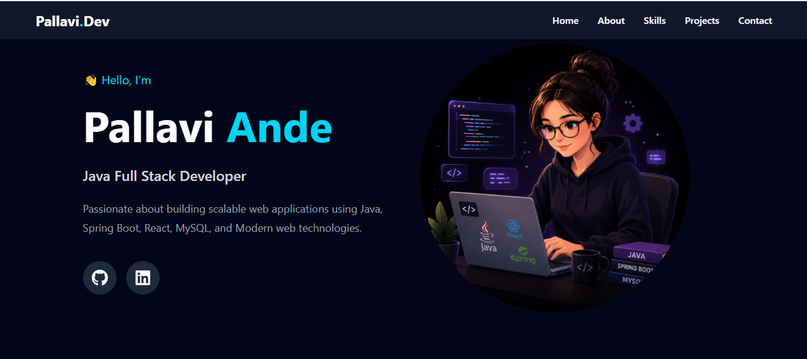

# Pallavi Portfolio

A personal portfolio website built using React, Javascript, Tailwind CSS, and Vite.



## About

This portfolio showcases my skills, projects, and journey as an aspiring Java Full Stack Developer. It includes information about me, technical skills, projects, and contact details.

## Features

* Responsive Design
* Hero Section
* About Me Section
* Skills Showcase
* Project Gallery
* Contact Section
* Modern UI with Tailwind CSS

## Tech Stack

* React.js
* Tailwind CSS
* JavaScript
* Vite

## Installation

1. Clone the repository

```bash
git clone git@github.com:Pallavi-A-12/pallavi-portfolio.git
```

2. Navigate to the project folder

```bash
cd pallavi-portfolio
```

3. Install dependencies

```bash
npm install
```

4. Start the development server

```bash
npm run dev
```

## Author

**Pallavi Ande**

MCA Graduate | Java Full Stack Developer

## Connect With Me

* [LinkedIn](https://www.linkedin.com/in/pallaviande) 
* [GitHub](https://github.com/Pallavi-A-12)
